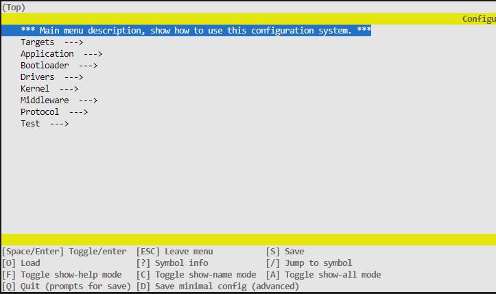
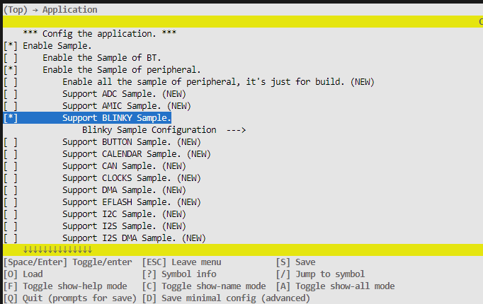
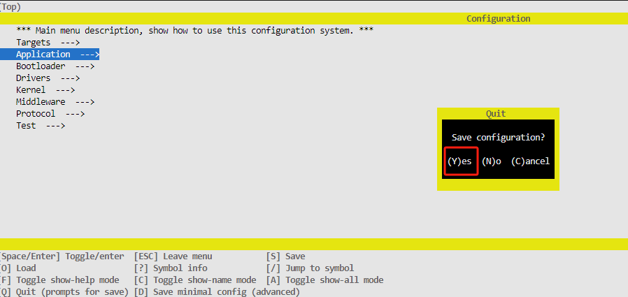
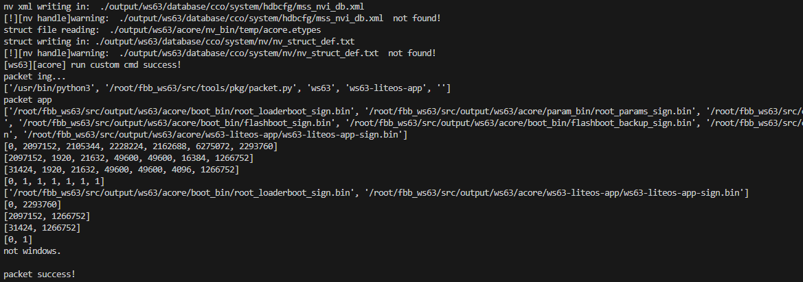
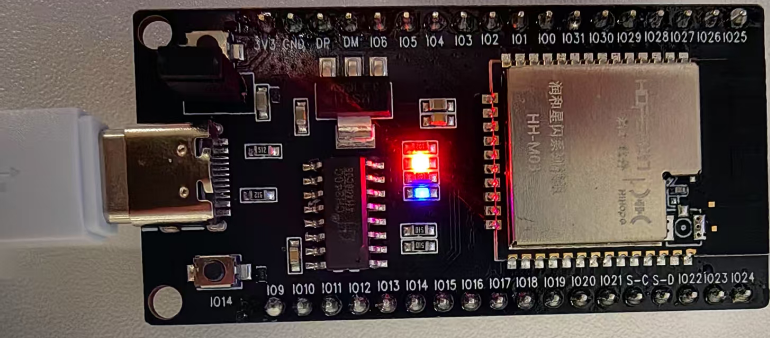
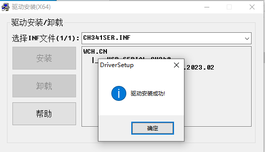
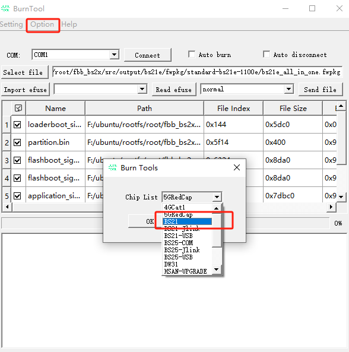
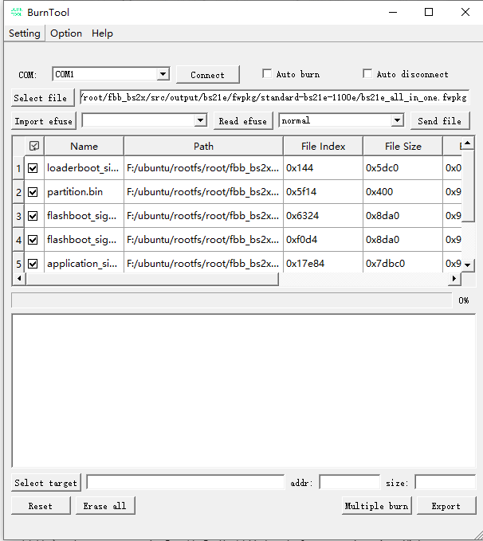
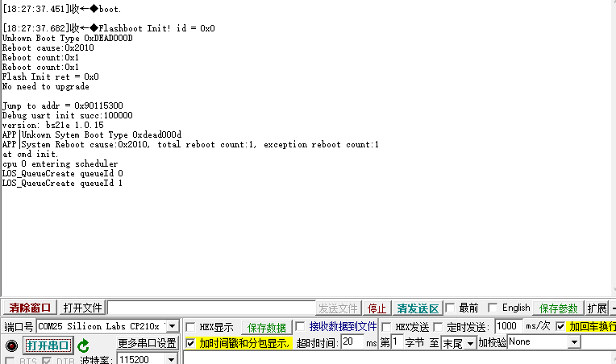

# 星闪代码编译

## 星闪代码下载

- 打开Vscode，在“远程资源管理器”打开“fbb_ws63”子系统

  

- 在“终端”新建一个终端

  


- 在新终端中输入`git clone https://gitee.com/HiSpark/fbb_bs2x.git`指令下载代码，等待下载完成。

  

## 星闪代码导入到VSCode

- 下载完成后,在"资源管理器"中选择打开文件夹

  

- 在弹出框中选择"/root/fbb_ws63/src"目录，点击确定

  

## 星闪代码编译

- 在终端命令行执行指令

  ```
  cd fbb_bs2x/src
  ```

- 在src目录下执行对应指令执行对应操作，参数及说明如下

  | 参数       | 示例                                                | 说明                                                      |
  | ---------- | --------------------------------------------------- | --------------------------------------------------------- |
  | 无         | python3 build.py standard-bs21e-1100e               | 启动standard-bs21e-1100e 目标的增量编译。                 |
  | -c         | python3 build.py -c standard-bs21e-1100e            | 启动standard-bs21e-1100e 目标的全量编译。                 |
  | menuconfig | python3 build.py -c standard-bs21e-1100e menuconfig | 启动standard-bs21e-1100e 目标的 menuconfig 图形配置界面。 |

- Menuconfig 配置，运行“python3 build.py -c standard-bs21e-1100e menuconfig”脚本会启动 Menuconfig 程 序，用户可通过Menuconfig 对编译和系统功能进行配置

  

- Menuconfig 操作说明如表，在Menuconfig 界面中可输入快捷键进行配置。

  | 快捷键     | 说明                     |
  | ---------- | ------------------------ |
  | 空格、回车 | 选中，反选。             |
  | ESC        | 返回上级菜单，退出界面。 |
  | Q          | 退出界面。               |
  | S          | 保存配置。               |
  | F          | 显示帮助菜单。           |

- 这里以Enable Sample 》Enable the Sample of peripheral》Support BLINKY SAMPLE为例

  
  
- 按“Enter”依次选中，然后在按“ESC”退出，在弹出的对话框按“y”选择yes

  

- 修改drivers\chips\bs2x\main_init\main_init.c文件，将下面的这段代码替换源文件内容，原因：方便通过typec口查看数据

  ```
  /**
   * Copyright (c) HiSilicon (Shanghai) Technologies Co., Ltd. 2022-2023. All rights reserved.
   *
   * Description: Application core os initialize interface for standard \n
   *
   * History: \n
   * 2022-07-27, Create file. \n
   */
  
  #include <stdint.h>
  #include "msg_chl.h"
  #include "nv.h"
  #include "nv_upg.h"
  #include "app_os_init.h"
  #include "log_common.h"
  #include "gpio.h"
  #include "chip_io.h"
  #include "lpc.h"
  #include "memory_core.h"
  #include "lpc_core.h"
  #ifdef XO_32M_CALI
  #include "efuse.h"
  #endif
  #include "clocks.h"
  #include "uart.h"
  #include "log_uart.h"
  #include "log_memory_region.h"
  #include "securec.h"
  #include "pinctrl_porting.h"
  #include "pinctrl.h"
  #include "tcxo.h"
  #include "cpu_trace.h"
  #include "application_version.h"
  #include "pmu.h"
  #include "systick.h"
  #include "watchdog.h"
  #if CHIP_ASIC
  #include "clock_calibration.h"
  #endif
  #ifdef CONFIG_SYSTEM_VIEW
  #include "SEGGER_SYSVIEW_Conf.h"
  #include "SEGGER_SYSVIEW.h"
  #endif
  #include "cpu_utils.h"
  #include "exception.h"
  #include "log_oml_exception.h"
  #include "los_task_pri.h"
  #include "los_init_pri.h"
  #include "los_hw.h"
  #include "oam_trace.h"
  
  #if (ENABLE_LOW_POWER == YES)
  #include "pmu_interrupt.h"
  #include "pm.h"
  #include "pm_veto.h"
  #endif
  #include "sfc.h"
  #include "sfc_porting.h"
  #include "arch_barrier.h"
  #include "watchdog_porting.h"
  #include "dfx_system_init.h"
  #include "main_test.h"
  #include "debug_print.h"
  #include "pmp_porting.h"
  #include "drv_pmp.h"
  #include "patch.h"
  #include "preserve.h"
  #if defined(SUPPORT_CFBB_UPG) || defined(CONFIG_BT_UPG_ENABLE) || defined(CONFIG_SLE_UPG_ENABLE)
  #include "partition.h"
  #include "upg.h"
  #endif
  #if defined(CONFIG_BT_UPG_ENABLE) || defined(CONFIG_SLE_UPG_ENABLE)
  #include "ota_upgrade.h"
  #endif
  #ifdef OS_DFX_SUPPORT
  #include "os_dfx.h"
  #endif
  #if defined(CONFIG_SECURE_STORAGE_SUPPORT)
  #include "security_init.h"
  #endif
  #if defined(SUPPORT_EXTERN_FLASH)
  #include "flash.h"
  #include "flash_porting.h"
  #endif
  #include "soc_osal.h"
  #ifdef SUPPORT_CHIP_N1200
  #ifndef DEVICE_ONLY
  #include "remote_lib.h"
  #endif
  #endif
  #include "non_os.h"
  #ifdef CONFIG_ULTRA_DEEP_SLEEP_ENABLE
  #include "keyscan_porting.h"
  #include "ulp_gpio.h"
  #endif
  #include "preserve.h"
  #ifdef SUPPORT_CHIP_N1200
  #ifdef OSAL_IRQ_RECORD_DEBUG
  #include "hal_tcxo.h"
  static uint32_t g_irq_lock_cnt = 0;
  static uint64_t g_irq_start_time = 0;
  static uint64_t g_irq_end_time = 0;
  #endif
  #endif
  
  #define WDT_TIMEOUT_S 30
  #define IMG_NUM_MAX   2
  #define IMG_SEC       0
  #define IMG_HIFI      1
  #define NFC_SOFT_RST              (GLB_CTL_D_RB_BASE + 0x0200)
  #define DTCM_SHARE_MODE           0xF90
  #define SHARE_MODE_GT             12
  #define SHARE_MODE_CFG            8
  
  #define CPU_TRACE_CLK_REG        0x5200410c
  #define CPU_TRACE_CLK_VAL        0x1ff
  
  #define PMP_REGION1_END         0x40000
  #define PMP_REGION2_END         0x58000
  #define PMP_REGION3_END         0x20000000
  #define PMP_REGION4_END         0x20010000
  #define PMP_REGION5_END         0x90100000
  #if defined (FLASH_1M)
  #define PMP_REGION6_END         0x901FE000
  #define PMP_REGION7_END         0x90200000
  #else
  #define PMP_REGION6_END         0x9017E000
  #define PMP_REGION7_END         0x90180000
  #endif
  
  typedef enum {
      PMP_ROM_ID1,
      PMP_ITCM_ID2,
      PMP_UNDEF_MEM_ID3,
      PMP_DTCM_ID4,
      PMP_UNDEF_MEM_ID5,
      PMP_SFC_IDX6,
      PMP_BT_SEC_IDX7,
      MAX_REGION_NUM
  } region_index_t;
  
  #ifdef SUPPORT_CHIP_N1200
  typedef unsigned int (* osal_irq_hook)(unsigned int);
  
  void osal_hook_register(osal_irq_hook restore, osal_irq_hook lock, osal_irq_hook unlock);
  
  __attribute__((section(".PMRAMCODE"))) unsigned int os_irq_restore(unsigned int irq_status)
  {
  #ifdef OSAL_IRQ_RECORD_DEBUG
      if ((osal_irq_record_flag_get() & OSAL_IRQ_RECORD_LOCK_CONSUME) != 0) {
          g_irq_lock_cnt--;
          if (g_irq_lock_cnt == 0) {
              g_irq_end_time = hal_tcxo_get();
              uint64_t cosume_time = g_irq_end_time - g_irq_start_time;
              osal_irq_record(IRQ_RESTORE, (td_u32)__builtin_return_address(0), irq_status, cosume_time);
          }
      }
  #endif
      LOS_IntRestore(irq_status);
      dsb();
      return OSAL_SUCCESS;
  }
  
  __attribute__((section(".PMRAMCODE"))) unsigned int os_irq_lock(unsigned int irq_status)
  {
      UNUSED(irq_status);
      unsigned int ret = LOS_IntLock();
      dsb();
  #ifdef OSAL_IRQ_RECORD_DEBUG
      if ((osal_irq_record_flag_get() & OSAL_IRQ_RECORD_LOCK_CONSUME) != 0) {
          if (g_irq_lock_cnt == 0) {
              g_irq_start_time = hal_tcxo_get();
              osal_irq_record(IRQ_LOCK, (td_u32)__builtin_return_address(0), ret, 0);
          }
          g_irq_lock_cnt++;
      }
  #endif
      return ret;
  }
  
  __attribute__((section(".PMRAMCODE"))) unsigned int os_irq_unlock(unsigned int irq_status)
  {
      UNUSED(irq_status);
  #ifdef OSAL_IRQ_RECORD_DEBUG
      if ((osal_irq_record_flag_get() & OSAL_IRQ_RECORD_LOCK_CONSUME) != 0) {
          g_irq_lock_cnt--;
          if (g_irq_lock_cnt == 0) {
              g_irq_end_time = hal_tcxo_get();
              uint64_t cosume_time = g_irq_end_time - g_irq_start_time;
              osal_irq_record(IRQ_UNLOCK, (td_u32)__builtin_return_address(0), 0, cosume_time);
          }
      }
  #endif
      unsigned int ret = LOS_IntUnLock();
      dsb();
      return ret;
  }
  #endif
  
  #ifdef CONFIG_SUPPORT_NFC_SERVICE
  void NFC_Init(void);
  #endif
  
  /*
   *  bs25 support pmp_attr：
   *  PMP_ATTR_DEVICE_NO_BUFFERABLE
   *  PMP_ATTR_NO_CACHEABLE_AND_BUFFERABLE
   *  PMP_ATTR_WRITEBACK_RALLOCATE
   *  PMP_ATTR_WRITEBACK_RWALLOCATE
   */
  static void app_mpu_enable(void)
  {
      pmp_conf_t region_attr[MAX_REGION_NUM] = {
          /* rom pmp */
          {
              PMP_ROM_ID1, PMP_REGION1_END, 0,
              { PMPCFG_READ_ONLY_EXECUTE, PMPCFG_ADDR_MATCH_TOR, true, PMP_ATTR_NO_CACHEABLE_AND_BUFFERABLE },
          },
          /* itcm: .ramtext .rodata */
          {
              PMP_ITCM_ID2, PMP_REGION2_END, 0,
              { PMPCFG_RW_EXECUTE, PMPCFG_ADDR_MATCH_TOR, true, PMP_ATTR_NO_CACHEABLE_AND_BUFFERABLE },
          },
          /* undef mem region */
          {
              PMP_UNDEF_MEM_ID3, PMP_REGION3_END, 0,
              { PMPCFG_RW_NEXECUTE, PMPCFG_ADDR_MATCH_TOR, true, PMP_ATTR_DEVICE_NO_BUFFERABLE },
          },
          /* dtcm: .data .bss .stack .heap */
          {
              PMP_DTCM_ID4, PMP_REGION4_END, 0,
              { PMPCFG_RW_NEXECUTE, PMPCFG_ADDR_MATCH_TOR, true, PMP_ATTR_NO_CACHEABLE_AND_BUFFERABLE },
          },
          /* undef mem region */
          {
              PMP_UNDEF_MEM_ID5, PMP_REGION5_END, 0,
              { PMPCFG_RW_NEXECUTE, PMPCFG_ADDR_MATCH_TOR, true, PMP_ATTR_DEVICE_NO_BUFFERABLE },
          },
          /* sfc code region */
          {
              PMP_SFC_IDX6, PMP_REGION6_END, 0,
              { PMPCFG_RW_EXECUTE, PMPCFG_ADDR_MATCH_TOR, true, PMP_ATTR_WRITEBACK_RWALLOCATE },
          },
          /* nv data */
          {
              PMP_BT_SEC_IDX7, PMP_REGION7_END, 0,
              { PMPCFG_RW_NEXECUTE, PMPCFG_ADDR_MATCH_TOR, true, PMP_ATTR_NO_CACHEABLE_AND_BUFFERABLE },
          },
      };
      uapi_pmp_config((pmp_conf_t *)region_attr, MAX_REGION_NUM);
      ArchICacheFlush();
      ArchDCacheFlush();
      ArchICacheEnable(CACHE_8KB);
      ArchICachePrefetchEnable(CACHE_PREF_1_LINES);
      ArchDCacheEnable(CACHE_4KB);
  }
  
  static void hardware_config_init(void)
  {
      uapi_gpio_init();
      size_t pin_num;
      hal_pio_config_t *pio_func = NULL;
      bool result = false;
  
      get_pio_func_config(&pin_num, &pio_func);
      for (pin_t i = S_MGPIO0; i < pin_num; i++) {
          if (pio_func[i].func != HAL_PIO_FUNC_INVALID) {
              if (pio_func[i].func == HAL_PIO_FUNC_DEFAULT_HIGH_Z) {
                  result = uapi_pin_set_mode(i, (pin_mode_t)HAL_PIO_FUNC_GPIO);
                  uapi_gpio_set_dir(i, GPIO_DIRECTION_INPUT);
              } else {
                  result = uapi_pin_set_mode(i, (pin_mode_t)pio_func[i].func);
                  result = uapi_pin_set_ds(i, (pin_drive_strength_t)pio_func[i].drive);
              }
              if (pio_func[i].pull != HAL_PIO_PULL_MAX) {
                  uapi_pin_set_pull(i, (pin_pull_t)pio_func[i].pull);
              }
  #if defined(CONFIG_PINCTRL_SUPPORT_IE)
              if (pio_func[i].ie != PIN_IE_MAX) {
                  uapi_pin_set_ie(i, (pin_input_enable_t)pio_func[i].ie);
              }
  #endif /* CONFIG_PINCTRL_SUPPORT_IE */
              UNUSED(result);
          } else {
  #if defined(CONFIG_PINCTRL_SUPPORT_IE)
              uapi_pin_set_ie(i, PIN_IE_0);
  #endif /* CONFIG_PINCTRL_SUPPORT_IE */
          }
      }
  }
  
  static void watchdog_init(void)
  {
      watchdog_turnon_clk();
      non_os_nmi_config(NMI_CWDT, true);
      watchdog_func_adapt(CHIP_WDT_TIMEOUT_8S);
      uapi_watchdog_init(CHIP_WDT_TIMEOUT_8S);
      uapi_watchdog_enable(CHIP_WDT_MODE_INTERRUPT);
  #if (CONFIG_WATCHDOG_SUPPORT_ULP_WDT == 1)
      ulp_wdt_init(ULP_WDT_TIMEOUT_10S);
  #endif
  }
  
  static bool pmu_control_pin_reset_enable(pin_t pin)  
  {  
      uapi_pin_set_mode(pin, 0);  
      uapi_pin_set_pull(pin, PIN_PULL_UP);  
  #if defined(CONFIG_PINCTRL_SUPPORT_IE)  
      uapi_pin_set_ie(pin, PIN_IE_1);  
  #endif  
      reg16_setbit(0x5702C51C, 0x0);  
      reg16_setbits(0x5702C51C, 0x4, 0x5, (uint8_t)pin);  
      uapi_tcxo_delay_ms(5);  
      reg16_clrbit(0x5702C51C, 0x0);  
      return true;  
  } 
  
  
  static void app_upg_init(void)
  {
  #if defined(SUPPORT_CFBB_UPG) || defined(CONFIG_BT_UPG_ENABLE) || defined(CONFIG_SLE_UPG_ENABLE)
      upg_func_t upg_func = {0};
      upg_func.malloc = malloc;
      upg_func.free = free;
      upg_func.serial_putc = NULL;
      (void)uapi_upg_init(&upg_func);
      uapi_partition_init();
  #endif
  #if defined(CONFIG_BT_UPG_ENABLE) || defined(CONFIG_SLE_UPG_ENABLE)
      uapi_upgrade_init();
  #endif
  }
  
  void bt_em_mem_enanble(void)
  {
      regw_setbits(M_CTL_RB_BASE, DTCM_SHARE_MODE, SHARE_MODE_GT, 0x2, 0x0);
  #ifdef EM_32K_SUPPORT
      regw_setbits(M_CTL_RB_BASE, DTCM_SHARE_MODE, SHARE_MODE_CFG, 0x2, 0x3);
  #else
      regw_setbits(M_CTL_RB_BASE, DTCM_SHARE_MODE, SHARE_MODE_CFG, 0x2, 0x1);
  #endif
      regw_setbits(M_CTL_RB_BASE, DTCM_SHARE_MODE, SHARE_MODE_GT, 0x2, 0x3);
  }
  
  #ifdef CONFIG_SUPPORT_NFC_SERVICE
  static void nfc_soft_reset(void)
  {
      reg_setbit(NFC_SOFT_RST, 0, 0);
      reg_setbit(NFC_SOFT_RST, 0, 1);
  }
  #endif
  
  static void ota_extern_flash_init(void)
  {
  #if defined(SUPPORT_EXTERN_FLASH)
      flash_porting_pinmux_cfg(0);
      uint32_t manufacture_id = 0;
      uapi_flash_init(0);
      uapi_flash_read_id(0, &manufacture_id);
      flash_save_manufacturer(0, manufacture_id);
  #endif
      pmu_control_pin_reset_enable(21);
  }
  
  #ifdef SUPPORT_SLP_CLIENT
  static void slp_client_init(void)
  {
      // bs21与slp SYNC管脚配置
  #ifdef CONFIG_AIR_MOUSE_HR_BOARD
      uapi_pin_set_mode(S_MGPIO10, PIN_MODE_61); // GPIO10置为sync管脚
  #else // CONFIG_AIR_MOUSE_SELF_BOARD
      uapi_pin_set_mode(S_MGPIO5, PIN_MODE_61); // GPIO5置为sync管脚
  #endif
  }
  #endif
  
  static void chip_hw_init(void)
  {
      uapi_tcxo_init();
      sfc_flash_config_t sfc_cfg = {
          .read_type = FAST_READ_QUAD_OUTPUT,
          .write_type = PAGE_PROGRAM,
          .mapping_addr = FLASH_START,
          .mapping_size = FLASH_LEN,
      };
      uapi_sfc_init(&sfc_cfg);
      uapi_systick_init();
  #ifdef XO_32M_CALI
      uapi_efuse_init();
      calibration_xo_core_ctrim_init();
  #endif
  #ifdef PRE_ASIC
      pmu_init();
      clocks_init();
  #endif
      panic_init();
      uapi_pin_init();
  #ifdef CONFIG_ULTRA_DEEP_SLEEP_ENABLE
      if (readw(0x5702C700) == 0) {
          hardware_config_init();
          writew(0x5702C700, 1);  // 首次boot记录
      } else {
          uapi_gpio_init();
          keyscan_port_register_irq(KEY_SCAN_IRQN);
      }
  #else
      uapi_pin_init();
      hardware_config_init();
  #endif
      uapi_nv_init();
      /* nv init must be before nv_upg_upgrade_task_process */
      (void)nv_upg_upgrade_task_process();
  
  #ifdef SW_UART_DEBUG
      sw_debug_uart_init(SW_UART_BAUDRATE);
      osal_printk("Debug uart init succ:%x\r\n", FLASH_LEN);
      osal_printk("version: %s\r\n", APPLICATION_VERSION_STRING);
      print_system_boot_status();
  #endif
  
      main_test_init();
  
  #if (ENABLE_LOW_POWER == YES)
      /* Init pmu interrupts, sleep and wakeup interrupts are included. */
      pmu_init_interrupts();
      uapi_pm_lpc_init();
  #endif
      ota_extern_flash_init();
  }
  
  static void chip_sw_init(void)
  {
      cpu_utils_init();
  #if defined(SUPPORT_DFX_LOG) && defined(CONFIG_SUPPORT_LOG_THREAD)
      log_memory_region_init();
      log_init();
      log_init_after_rtos();
      log_uart_init();
      log_uart_init_after_rtos();
  #endif
  
  #ifdef CONFIG_SYSTEM_VIEW
      SEGGER_SYSVIEW_Conf();
  #endif
  
  #ifdef HSO_SUPPORT
      dfx_system_init();
      hal_register_exception_dump_callback(log_exception_dump);
      app_upg_init();
  #endif
  
      /* Enable MCPU trace */
      if (get_cpu_utils_reset_cause() != REBOOT_CAUSE_APPLICATION_STD_CHIP_WDT_FRST) {
          cpu_trace_enable_mcpu_repeat();
  #ifdef OS_DFX_SUPPORT
          os_dfx_trace_init();
          LOS_TaskSwitchHookReg(os_dfx_task_switch_trace);
          LOS_HwiPreHookReg(os_dfx_hwi_pre);
          LOS_HwiPostHookReg(os_dfx_hwi_post);
  #endif
      } else {
          writel(CPU_TRACE_CLK_REG, CPU_TRACE_CLK_VAL);
      }
  }
  
  static void chip_rf_init(void)
  {
      /* bt msg queue init. */
      LOS_MsgChl_Init();
      bt_em_mem_enanble();
  
  #ifdef CONFIG_SUPPORT_NFC_SERVICE
      nfc_soft_reset();
      NFC_Init();
  #endif
  
  #ifdef EDA_TEST
      bt_eda_init();
  #endif
  
  #ifdef SUPPORT_SLP_CLIENT
      slp_client_init();
  #endif
  }
  
  #ifndef CONFIG_POWER_SUPPLY_BY_LDO
  static void pm_buck_state_check(void)
  {
      if ((readw(0x5702C110) >> 0x8) == 0) {  // buck未正常打开
          osal_printk("buck reboot.\n");
          uapi_tcxo_delay_ms(5);      // 5：delay 5ms，保证日志打出来
          writew(0x5702C048, 0x1);    // buck flag
          writew(0x5702C230, 0x400);  // 打开AFE ISO
          writew(0x5702C200, 0x1);    // cldo强拉
          writew(0x5702C270, 0x0);
          writew(0x5702C26C, 0x1);    // buck关闭
          writew(0x5702C204, 0x7001); // micldo关闭
          uapi_tcxo_delay_us(10);     // 10: delay 10us after buck close
          writew(0x5702C984, 0xFF);
          writew(0x5702C980, 0x0);    // 主动重启
      }
  }
  #endif
  
  static uint32_t rtos_kernel_init(void)
  {
      BoardConfig();
      if (OsMain() == LOS_OK) {
          /* set exception and nmi entry. */
          ArchSetExcHook((EXC_PROC_FUNC)do_fault_handler);
          ArchSetNMIHook((NMI_PROC_FUNC)do_hard_fault_handler);
          return ERRCODE_SUCC;
      } else {
          return ERRCODE_FAIL;
      }
  }
  
  static void rtos_kernel_start(void)
  {
      OsStart();
  }
  
  /*
   *  bs2x 初始化入口：
   *  chip_hw_init(): 芯片硬件初始化（不可修改）。
   *  chip_sw_init(): 芯片软件初始化（不可修改）。
   *  chip_rf_init(): 芯片协议初始化（不可修改）。
   *  rtos_kernel_init()： 软件os初始化（不可修改）。
   *  app_os_init():  线程初始化，详细定义请参考 drivers/chips/bs2x/main_init/app_os_init.c 文件。
   */
  
  void main_init(void)
  {
  #ifdef SUPPORT_CHIP_N1200
  #ifndef DEVICE_ONLY
      rl_driver_deinit();
      osal_hook_register(os_irq_restore, os_irq_lock, os_irq_unlock);
      sfc_port_set_mutex_hook(NULL, (osal_mutex_hook)os_irq_lock, (osal_mutex_hook)os_irq_unlock);
  #endif
  #endif
      func_patch_init();
      watchdog_init();
      app_mpu_enable();
  #if defined(CONFIG_SECURE_STORAGE_SUPPORT)
      uapi_drv_cipher_env_init();
  #endif
      /* rtos kernel init. */
      if (rtos_kernel_init() == ERRCODE_SUCC) {
          /* hardware & software init. */
          chip_hw_init();
          chip_sw_init();
          chip_rf_init();
  
  #ifndef CONFIG_POWER_SUPPLY_BY_LDO
          pm_buck_state_check();
  #endif
          /* rtos thread init. */
          app_os_init();
          /* rtos kernel start. */
          rtos_kernel_start();
      }
  
      for (;;) { }
  }
  ```
  
- 

- 在终端输入“python3 build.py standard-bs21e-1100e”

  ```
  python3 build.py standard-bs21e-1100e
  ```
  
- 等待编译完成，编译成功如下
  
  


## 镜像烧录


- 硬件搭建：Typec线将板端与PC端连接

  

- 安装驱动“CH341SER驱动”（[CH341SER驱动下载地址](https://www.wch.cn/downloads/CH341SER_EXE.html)，**如果该链接失效或者无法下载，用户自行百度下载即可**），安装CH341SER驱动，安装前单板需要与PC端相连，点击安装即可，显示**驱动安装成功代表成功**，如果出现**驱动预安装成功代表安装失败**

  

  

-  下载BurnTool烧录工具并解压。

    ```hljs
    链接：https://gitee.com/hihope_iot/near-link/tree/master/tools
    ```

- 打开烧录工具，选择对应的串口,打开烧录工具,点开Option选项,选择对应的目标即可,WS63E与WS63属于同一款系列，选择WS63即可。

  

- 选择烧录文件,示例路径为（选ws63-liteos-app-all.fwpkg）

  ```hljs
  F:\ubuntu\rootfs\root\fbb_bs2x\src\output\bs21e\fwpkg\standard-bs21e-1100e\bs21e_all_in_one.fwpkg
  ```
  
- 勾选Auto Burn和Auto disconnect选项,点击connect连接,单按开发板RST按键 开始烧录。

- 烧录完成结果如下：

  
  

  （4） 打开串口工具,波特率选择115200,上电后可以看到相关的串口打印。（用户百度下载串口工具即可，例如：sscom、xshell）

  

## FAQ

-  如果根据文档没有编译成功，请参考https://developers.hisilicon.com/postDetail?tid=02110170392979486020
-  如果根据文档编译成功，但是在编写其他代码后，导致编译失败，可以在论坛提问，论坛链接：https://developers.hisilicon.com/forum/0133146886267870001


​    

  
