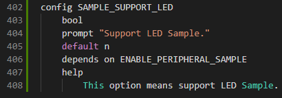

# LED

## 1.1 介绍

**功能介绍：** 交通灯板上红色LED灯循环闪烁。

**软件概述：** GPIO引脚输出高低电平状态。

**硬件概述：** 核心板、交通灯板。通过交通灯板上丝印可以看出是RED与底板的D10相连，底板左边位置D10对应核心板上GPIO 7。硬件搭建要求如图所示：

  参考[交通灯板原理图](../../doc/hardware/HiSpark_WiFi_IoT_SSL_VER.A.pdf)、[底板原理图](../../doc/hardware/HiSpark_WiFi_IoT_EXB_VER.A.pdf)、[核心板原理图](../../doc/hardware/HH-D03_原理图_V01.pdf)

## 1.2 约束与限制

### 1.2.1 支持应用运行的芯片和开发板

  本示例支持开发板：HH-D03

### 1.2.2 支持API版本、SDK版本

  本示例支持版本号：1.0.15以上

### 1.2.3 支持IDE版本

  本示例支持IDE版本号：1.0.0.10以上；

## 1.3 效果预览

通过交通灯板上红色LED灯循环闪烁

## 1.4 接口介绍

### 1.4.1 uapi_gpio_set_dir()

| **定义：**   | errcode_t uapi_gpio_set_dir(pin_t pin, gpio_direction_t dir); |
| ------------ | ------------------------------------------------------------- |
| **功能：**   | 设置GPIO的输入输出方向函数                                    |
| **参数：**   | pin： io引脚 dir：输入输出方向                            |
| **返回值：** | ERROCODE_SUCC：成功    Other：失败                            |
| **依赖：**   | include\driver\gpio.h                                         |

### 1.4.2 uapi_gpio_set_val()

| 定义：       | errcode_t uapi_gpio_set_val(pin_t pin, gpio_level_t level); |
| ------------ | ----------------------------------------------------------- |
| **功能：**   | 设置GPIO的输出状态                                          |
| **参数：**   | pin：io引脚 level：设置输出为高或低                     |
| **返回值：** | ERROCODE_SUCC：成功    Other：失败                          |
| **依赖：**   | include\driver\gpio.h                                       |

### 1.4.3 uapi_gpio_toggle()

| **定义：**   | errcode_t uapi_gpio_toggle(pin_t pin); |
| ------------ | -------------------------------------- |
| **功能：**   | 翻转输出GPIO电平状态.                  |
| **参数：**   | pin：io引脚                            |
| **返回值：** | ERROCODE_SUCC：成功    Other：失败     |
| **依赖：**   | include\driver\gpio.h                  |

## 1.5 具体实现

步骤一：设置GPIO为输出模式；

步骤二：设置GPIO输出为高或低；

步骤三：翻转输出GPIO电平状态

## 1.6 实验流程

- 步骤一：在xxx\src\application\samples\peripheral文件夹新建一个sample文件夹，在peripheral上右键选择“新建文件夹”，创建Sample文件夹，例如名称”led“。

  
- 步骤二：将xxx\vendor\HiHope_NearLink_DK_WS63E_V03\led文件里面内容拷贝到**步骤一创建的Sample文件夹中”led“**。

  
- 步骤三：在xxx\src\application\samples\peripheral\CMakeLists.txt文件中新增编译案例，具体如下图所示（如果不知道在哪个地方加的，可以在“set(SOURCES "${SOURCES}" PARENT_SCOPE)”上面一行添加）。

  
- 步骤四：在xxx\src\application\samples\peripheral\Kconfig文件中新增编译案例，具体如下图所示（如果不知道在哪个地方加，可以在最后一行添加）。

  
- 步骤五：点击如下图标，选择KConfig，具体选择路径“Application/Enable the Sample of peripheral”，在弹出框中选择“support LED Sample”，点击Save，关闭弹窗。

  
- 步骤六：点击“build”或者“rebuild”编译

  
- 步骤七：编译完成如下图所示。

  
- 步骤八：在HiSpark Studio工具中点击“工程配置”按钮，选择“程序加载”，传输方式选择“serial”，端口选择“comxxx”，com口在设备管理器中查看（如果找不到com口，请参考windows环境搭建）。

  
- 步骤九：配置完成后，点击工具“程序加载”按钮烧录。

  
- 步骤十：出现“Connecting, please reset device...”字样时，复位开发板，等待烧录结束。

  
- 步骤十一：“软件烧录成功后，按一下开发板的RESET按键复位开发板，可以通过交通灯板上红色LED灯循环闪烁。
