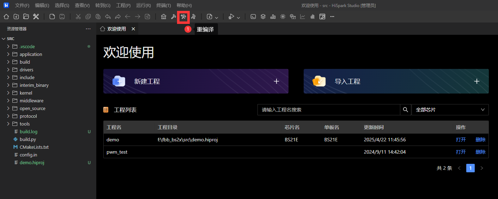
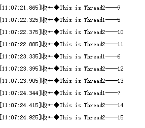

# thread/线程

## 1.1 介绍

**功能介绍：** 本实验内容实现了创建两个任务进程task，任务1每1S打印一次“This is Thread1---”，任务二每500ms打印一次“This is Thread2---”。

**软件概述：** 任务是竞争系统资源的最小运行单元。任务可以使用或等待CPU、使用内存空间等系统资源，并独立于其它任务运行。任务模块可以给用户提供多个任务，实现了任务之间的切换和通信，帮助用户管理业务程序流程。

- 支持多任务，一个任务表示一个线程。
- 任务是抢占式调度机制，同时支持时间片轮转调度方式。
- 高优先级的任务可打断低优先级任务，低优先级任务必须在高优先级任务阻塞或结束后才能得到调度。
- 有32个优先级[0, 31],最高优先级为0，最低优先级为31，建议用户使用优先级范围是[10, 30]

**硬件概述：**[核心板原理图](../../../../docs/hardware/HH-D03/HH-D03_原理图_V01.pdf)。硬件搭建要求如图所示：

## 1.2 约束与限制

### 1.2.1 支持应用运行的芯片和开发板

  本示例支持开发板：HH-D03

### 1.2.2 支持API版本、SDK版本

  本示例支持版本号：1.0.15以上

### 1.2.3 支持IDE版本

  本示例支持IDE版本号：1.0.0.10以上；

## 1.3 效果预览

任务1每1S打印一次“This is Thread1----”，任务二每500ms打印一次“This is Thread2----。

## 1.4 接口介绍

### 1.4.1 osal_kthread_lock()

| **定义：**   | void osal_kthread_lock(void);            |
| ------------ | ---------------------------------------- |
| **功能：**   | 禁止系统任务调度                         |
| **参数：**   | void类型                                 |
| **返回值：** | 无                                       |
| **依赖：**   | kernel\osal\include\schedule\osal_task.h |

### 1.4.2 osal_kthread_create()

| 定义：       | osal_task *osal_kthread_create(osal_kthread_handler handler, void *data, const char *name, unsigned int stack_size); |
| ------------ | -------------------------------------------------------------------------------------------------------------------- |
| **功能：**   | 创建任务                                                                                                             |
| **参数：**   | handler：线程要处理的函数 data：函数处理程序数据 name：显示的线程名称 stack_size：线程堆栈空间的大小     |
| **返回值：** | ERRCODE_SUCC：成功    Other：失败                                                                                    |
| **依赖：**   | kernel\osal\include\schedule\osal_task.h                                                                             |

### 1.4.3 osal_kthread_set_priority()

| **定义：**   | int osal_kthread_set_priority(osal_task *task, unsigned int priority); |
| ------------ | ---------------------------------------------------------------------- |
| **功能：**   | 设置任务优先级                                                         |
| **参数：**   | task：要排定优先级的线程 priority：要设定的优先级                  |
| **返回值：** | OSAL_SUCCESS：成功    OSAL_FAILURE：失败                               |
| **依赖：**   | kernel\osal\include\schedule\osal_task.h                               |

### 1.4.4 osal_kthread_unlock()

| **定义：**   | void osal_kthread_unlock(void);          |
| ------------ | ---------------------------------------- |
| **功能：**   | 允许系统任务调度                         |
| **参数：**   | void                                     |
| **返回值：** | 无                                       |
| **依赖：**   | kernel\osal\include\schedule\osal_task.h |

## 1.5 具体实现

步骤一：在xxx\src\kernel\liteos\liteos_v208.5.0\Huawei_LiteOS\.config中配置任务数，默认为20，配置LOSCFG_BASE_CORE_TSK_LIMIT系统支持最大任务数需要根据用户需求配置；

步骤二：锁任务osal_kthread_lock，锁住任务，防止高优先级任务调度；

步骤三：创建任务osThreadNew；

步骤四：运行任务app_run()，代码总入口;

步骤五：解锁任务osal_kthread_unlock，让任务按照优先级进行调度；

## 1.6 案例实现

- 步骤一：在xxx\src\application\samples\peripheral文件夹新建一个sample文件夹，在peripheral上右键选择“新建文件夹”，创建Sample文件夹，例如名称”thread“。

  
- 步骤二：将xxx\vendor\HH-D03\thread文件里面内容“CMakeList.txt”、“thread_example.c”拷贝到**步骤一创建的Sample文件夹中”thread“**下。

- 步骤三：在xxx\src\application\samples\peripheral\CMakeLists.txt文件中新增编译案例，具体如下图所示（如果不知道在哪个地方加的，可以在“set(SOURCES "${SOURCES}" PARENT_SCOPE)”上面一行添加）。

- 步骤四：在xxx\src\application\samples\peripheral\Kconfig文件中新增编译案例，具体如下图所示（如果不知道在哪个地方加，可以在最后一行添加）。

  
- 步骤五：点击如下图标，选择KConfig，具体选择路径“Application/Enable the Sample of peripheral”，在弹出框中选择“support THREAD Sample”，点击Save，关闭弹窗。

  
- 步骤六：点击“build”或者“rebuild”编译

  
- 步骤七：编译完成如下图所示。

  
- 步骤八：在HiSpark Studio工具中点击“工程配置”按钮，选择“程序加载”，传输方式选择“serial”，端口选择“comxxx”，com口在设备管理器中查看（如果找不到com口，请参考windows环境搭建）。

  
- 步骤九：配置完成后，点击工具“程序加载”按钮烧录。

  
- 步骤十：出现“Connecting, please reset device...”字样时，复位开发板，等待烧录结束。

  
- 步骤十一：软件烧录成功后，按一下开发板的RESET按键复位开发板，烧录完成后，任务1每1S打印一次“This is Thread1----”，任务二每500ms打印一次“This is Thread2。串口打印信息如下。

  
