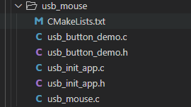

## usbdemo

## 1.1 介绍

USB_HID类是USB设备的一个标准设备类，属于人机交互操作的设备，包括鼠标、 键盘等，主要用于人与计算机进行交互。还可用来传输数据、控制设备等，如影像显 示设备可能使用HID接口来做亮度、对比度的软件控制，而使用传统的影像接口来传 送要显示的数据。USB扩音器可以使用实时传输来播放语音，同时使用HID接口来控 制音量等。HID设备可以作为低速、 全速、高速设备用。由于HID设备要求用户输入 能得到及时响应，故其传输方式通常采用中断方式

**硬件概述：** 核心板、底板。核心板主板插在底板上，查看底板左侧，通过查看主板丝印核心板TXD1对应底板TX，在底板右侧寻找TX硬件接口，使用杜邦线（跳线帽）将TX与RX相连，核心板主板插在底板上，查看底板左侧，通过查看主板丝印核心板RXD1对应底板RX，在底板右侧寻找RX硬件接口，使用杜邦线（跳线帽）将TX与RX相连。一般情况下两块UART设备（A和B）通信，硬件接线方式为A板TX接B板RX，A板RX接B板TX，这里由于硬件数量有限，使用一块单板验证，单板的TX与RX通过杜邦线或者跳线帽相连。硬件搭建要求如图所示：

**硬件概述：**[核心板原理图](../../doc/hardware/HH-D03_原理图_V01.pdf)。硬件搭建要求如图所示：

## 1.2 约束与限制

### 1.2.1 支持应用运行的芯片和开发板

  本示例支持开发板：HH-D03

### 1.2.2 支持API版本、SDK版本

  本示例支持版本号：1.0.15以上

### 1.2.3 支持IDE版本

  本示例支持IDE版本号：1.0.0.10以上；

## 1.3 效果预览

## 1.4 接口说明

### 1.4.1 usb_init()

| **定义：**   | uint32_t usb_init(controller_type ctype, device_type dtype) |
| ------------ | ----------------------------------------------------------- |
| **功能：**   | 初始化USB                                                   |
| **参数：**   | ctype：控制器的类型 dtype：设备类型                     |
| **返回值：** | ERRCODE_SUCC：成功    Other：失败                           |
| **依赖：**   | include\driver\usb\implementation\usb_init.h                |

### 1.4.2 usb_deinit()

| **定义：**   | uint32_t usb_deinit(void);                   |
| ------------ | -------------------------------------------- |
| **功能：**   | 去初始化USB                                  |
| **参数：**   |                                              |
| **返回值：** | ERRCODE_SUCC：成功    Other：失败            |
| **依赖：**   | include\driver\usb\implementation\usb_init.h |

### 1.4.3 usbd_set_device_info()

| **定义：**   | uint32_t usbd_set_device_info(device_type dtype,const struct device_string *str_manufacturer,const struct device_string *str_product,const struct device_string *str_serial_number,struct device_id dev_id） |
| ------------ | ------------------------------------------------------------ |
| **功能：**   | 设置设备VID、PID和字符串描述符信息                           |
| **参数：**   | dtype：设备类型 str_manufacturer：制造商字符串信息 str_product：产品字符串信息 str_serial_number：序列号字符串信息 dev_id：VID、PID和设备版本号 |
| **返回值：** | ERRCODE_SUCC：成功    Other：失败                            |
| **依赖：**   | include\driver\usb\implementation\usb_init.h                 |

### 1.4.4 fhid_send_data()

| **定义：**   | size_t fhid_send_data(uint8_t report_index, const char *buf, size_t buflen); |
| ------------ | ------------------------------------------------------------ |
| **功能：**   | 数据发送                                                     |
| **参数：**   |                                                              |
| **返回值：** | ERRCODE_SUCC：成功    Other：失败                            |
| **依赖：**   | include\driver\usb\implementation\usb_init.h                 |

### 1.4.5 fhid_recv_data()

| **定义：**   | int32_t uapi_uart_read(uart_bus_t bus, const uint8_t *buffer, uint32_t length, uint32_t timeout); |
| ------------ | ------------------------------------------------------------ |
| **功能：**   | 数据接收                                                     |
| **参数：**   |                                                              |
| **返回值：** | ERRCODE_SUCC：成功    Other：失败                            |
| **依赖：**   | include\driver\usb\implementation\usb_init.h                 |

## 1.5 具体实现

步骤一：配置报告描述符信息，设置报告数据格式和功能。

步骤二：首先配置device设备的VID、 PID、设备版本号和厂商、产品、序列号字符串信息。

步骤三：USB初始化。device type为DEV_HID。

步骤四：发送鼠标数据。

## 1.6 实验流程

- 步骤一：在xxx\src\application\samples\peripheral文件夹新建一个sample文件夹，在peripheral上右键选择“新建文件夹”，创建Sample文件夹，例如名称”uartdemo“。

  
- 步骤二：将xxx\vendor\HiHope_NearLink_DK_WS63E_V03\usbdemo文件里面内容拷贝到**步骤一创建的Sample文件夹中usbdemo“**。

  
- 步骤三：在xxx\src\application\samples\peripheral\CMakeLists.txt文件中新增编译案例，具体如下图所示（如果不知道在哪个地方加的，可以在“set(SOURCES "${SOURCES}" PARENT_SCOPE)”上面一行添加）。

  
- 步骤四：在xxx\src\application\samples\peripheral\Kconfig文件中新增编译案例，具体如下图所示（如果不知道在哪个地方加，可以在最后一行添加）。

  
- 步骤五：点击如下图标，选择KConfig，具体选择路径“Application/Enable the Sample of peripheral”，在弹出框中选择“support UARTDEMO Sample”，点击Save，关闭弹窗。

  
- 步骤六：点击“build”或者“rebuild”编译

  
- 步骤七：编译完成如下图所示。

  
- 步骤八：在HiSpark Studio工具中点击“工程配置”按钮，选择“程序加载”，传输方式选择“serial”，端口选择“comxxx”，com口在设备管理器中查看（如果找不到com口，请参考windows环境搭建）。

  
- 步骤九：配置完成后，点击工具“程序加载”按钮烧录。

  
- 步骤十：出现“Connecting, please reset device...”字样时，复位开发板，等待烧录结束。

  
- 步骤十一：软件烧录成功后，按一下开发板的RESET按键复位开发板，烧录完成后，可以通过开发板上的按键用作鼠标。

  
